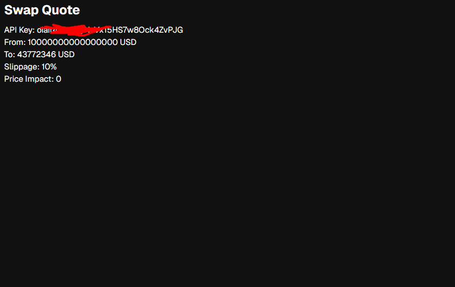

# Thành Quả
## GET SWAP QUOTE 
# MiniKit Template

This is a [Next.js](https://nextjs.org) project bootstrapped with [`create-onchain --mini`](), configured with:

- [MiniKit](https://docs.base.org/builderkits/minikit/overview)
- [OnchainKit](https://www.base.org/builders/onchainkit)
- [Tailwind CSS](https://tailwindcss.com)
- [Next.js](https://nextjs.org/docs)

## Getting Started

1. Install dependencies:
```bash
npm install
# or
yarn install
# or
pnpm install
# or
bun install
```

2. Verify environment variables, these will be set up by the `npx create-onchain --mini` command:

You can regenerate the FARCASTER Account Association environment variables by running `npx create-onchain --manifest` in your project directory.

The environment variables enable the following features:

- Frame metadata - Sets up the Frame Embed that will be shown when you cast your frame
- Account association - Allows users to add your frame to their account, enables notifications
- Redis API keys - Enable Webhooks and background notifications for your application by storing users notification details

```bash
# Shared/OnchainKit variables
NEXT_PUBLIC_ONCHAINKIT_PROJECT_NAME=
NEXT_PUBLIC_URL=
NEXT_PUBLIC_ICON_URL=
NEXT_PUBLIC_ONCHAINKIT_API_KEY=

# Frame metadata
FARCASTER_HEADER=
FARCASTER_PAYLOAD=
FARCASTER_SIGNATURE=
NEXT_PUBLIC_APP_ICON=
NEXT_PUBLIC_APP_SUBTITLE=
NEXT_PUBLIC_APP_DESCRIPTION=
NEXT_PUBLIC_APP_SPLASH_IMAGE=
NEXT_PUBLIC_SPLASH_BACKGROUND_COLOR=
NEXT_PUBLIC_APP_PRIMARY_CATEGORY=
NEXT_PUBLIC_APP_HERO_IMAGE=
NEXT_PUBLIC_APP_TAGLINE=
NEXT_PUBLIC_APP_OG_TITLE=
NEXT_PUBLIC_APP_OG_DESCRIPTION=
NEXT_PUBLIC_APP_OG_IMAGE=

# Redis config
REDIS_URL=
REDIS_TOKEN=
```

3. Start the development server:
```bash
npm run dev
```

## Template Features

### Frame Configuration
- `.well-known/farcaster.json` endpoint configured for Frame metadata and account association
- Frame metadata automatically added to page headers in `layout.tsx`

### Background Notifications
- Redis-backed notification system using Upstash
- Ready-to-use notification endpoints in `api/notify` and `api/webhook`
- Notification client utilities in `lib/notification-client.ts`

### Theming
- Custom theme defined in `theme.css` with OnchainKit variables
- Pixel font integration with Pixelify Sans
- Dark/light mode support through OnchainKit

### MiniKit Provider
The app is wrapped with `MiniKitProvider` in `providers.tsx`, configured with:
- OnchainKit integration
- Access to Frames context
- Sets up Wagmi Connectors
- Sets up Frame SDK listeners
- Applies Safe Area Insets

## Customization

To get started building your own frame, follow these steps:

1. Remove the DemoComponents:
   - Delete `components/DemoComponents.tsx`
   - Remove demo-related imports from `page.tsx`

2. Start building your Frame:
   - Modify `page.tsx` to create your Frame UI
   - Update theme variables in `theme.css`
   - Adjust MiniKit configuration in `providers.tsx`

3. Add your frame to your account:
   - Cast your frame to see it in action
   - Share your frame with others to start building your community

## Learn More

- [MiniKit Documentation](https://docs.base.org/builderkits/minikit/overview)
- [OnchainKit Documentation](https://docs.base.org/builderkits/onchainkit/getting-started)
- [Next.js Documentation](https://nextjs.org/docs)
- [Tailwind CSS Documentation](https://tailwindcss.com/docs)
